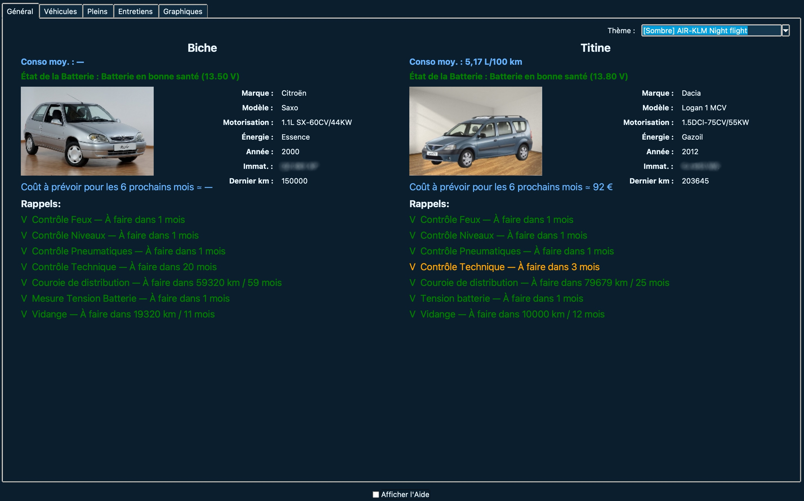
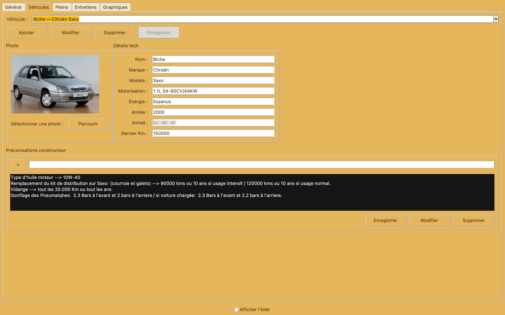
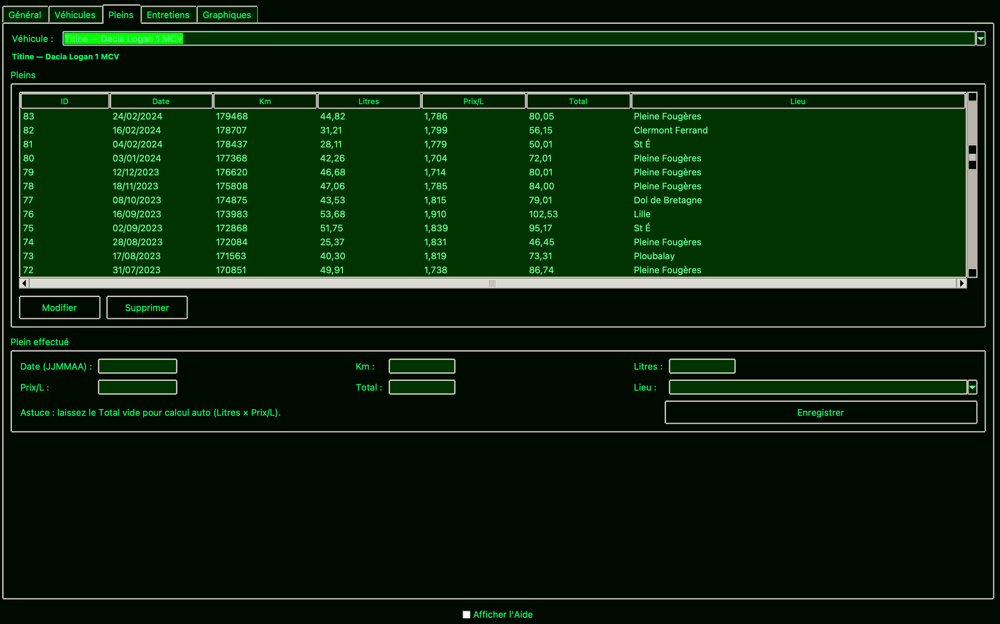
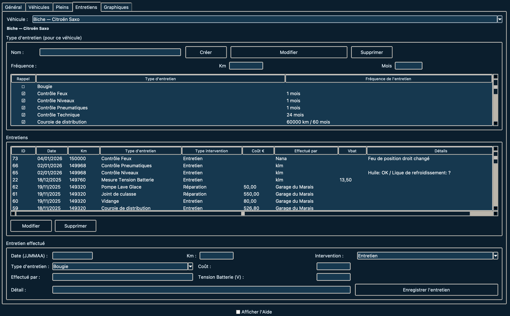
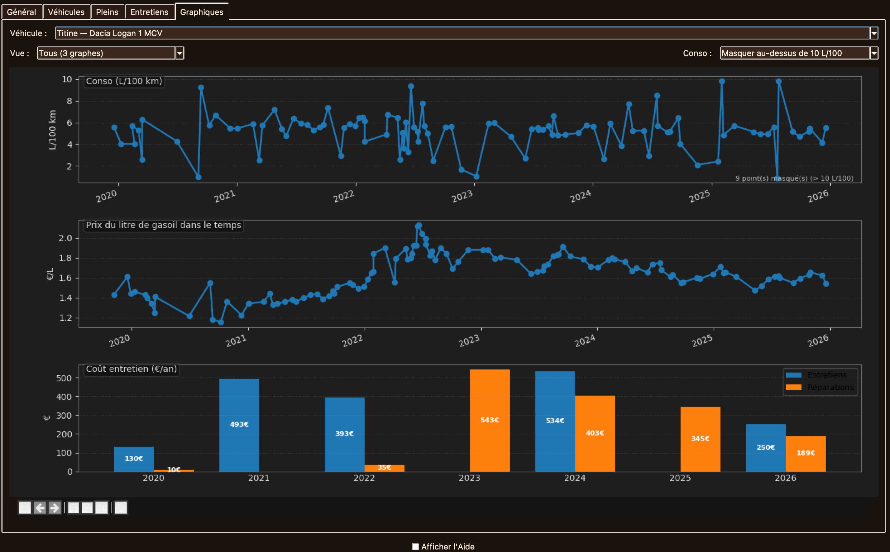

# GARAGE


**Garage** est une application simple et autonome pour suivre les informations essentielles de vos véhicules.

Elle permet de gérer :

- les véhicules (type, photo, caractéristiques),
- les entretiens réalisés et à prévoir, avec leurs fréquences constructeur,
- les pleins de carburant.
- Votre budget véhicule.

L’onglet **Général** affiche automatiquement :

- les rappels d’entretien à effectuer,
- la moyenne du coût du véhicule par an, 
- la consommation moyenne (L/100 km),
- une estimation des coûts à prévoir sur les six prochains mois,
- l’état de la batterie (si renseigné).
- Des graphiques de la conso L/100km de l'évolution dans le temps des prix -entretiens /réparations /carburant.
---

## Aperçu








---

## 📥 Téléchargement

👉 Les versions compilées sont disponibles dans la section **Releases** :  
https://github.com/mrklm/garage/releases

### Applications standalone (recommandé)

- **Linux**  
  - `Garagev4.4.18-linux-x86_64.Appimage`
  - `Garagev4.4.18-linux-x86_64.Appimage.sha`
  - `Garage v4.4.18 linux-x86_64.tar.gz`
  - `Garage v4.4.18 linux-x86_64.tar.gz.sha`

- **macOS**  
  - `Garage-4.4.18-macOS-x86_64.dmg `
  - `Garage-4.4.18-macOS-x86_64.dmg.sha`

- **Windows**  
  - `Garage-v4.4.18-windows-x86_64.zip`
  - `Garage-v4.4.18-windows-x86_64.zip.sha`

---

## 🐧 Linux / Ubuntu

### Option 1 — AppImage (recommandé)

```bash
chmod +x Garagev4.4.18-linux-x86_64.Appimage
./Garagev4.4.18-linux-x86_64.Appimage
```

### Option 2 — Archive `.tar.gz`

```bash
tar -xzf "Garage v4.4.18 linux-x86_64.tar.gz"
cd "Garage v4.4.18 linux-x86_64"
./Garage
```

---

## 💾 Données et base de données

Garage utilise une **base de données persistante**.

Lors du premier lancement, la base est automatiquement créée dans :

```text
~/.local/share/Garage/garage.db
```

---

## 🚀 Installation depuis les sources (optionnel)

### Prérequis
- Python 3.10+
- Tkinter
- SQLite
- Pillow (recommandé)

### 1. Cloner le dépôt
```bash
git clone https://github.com/mrklm/garage.git
cd garage
```

### 2. Créer un environnement virtuel
```bash
python3 -m venv .venv
source .venv/bin/activate
pip install -r requirements.txt
```

### 3. Lancer l’application
```bash
python garage.py
```

---

## 📜 Licence

Ce logiciel est distribué sous la **GNU General Public License v3.0**.

---

## 🛠️ Contribuer

Les contributions sont les bienvenues via *Pull Requests*.

---

## 📬 Contact

**clementmorel@free.fr**

---

✨ Bonne route avec Garage !
